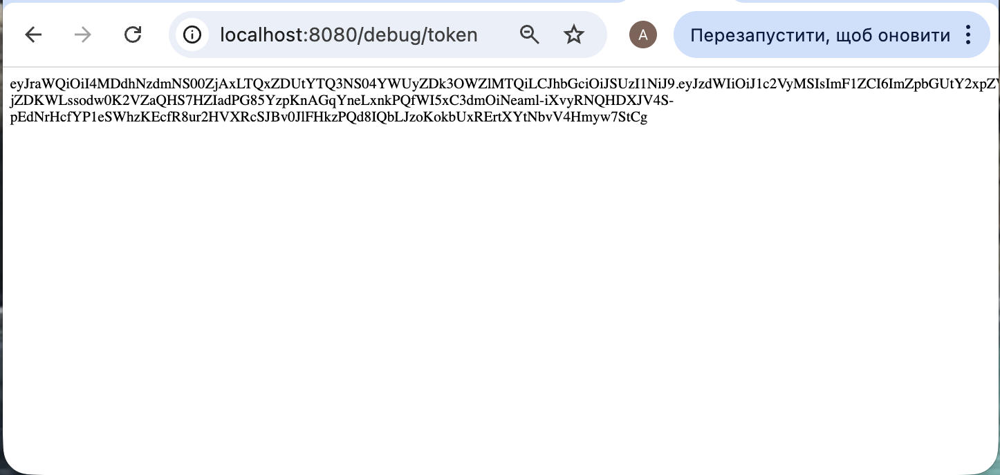
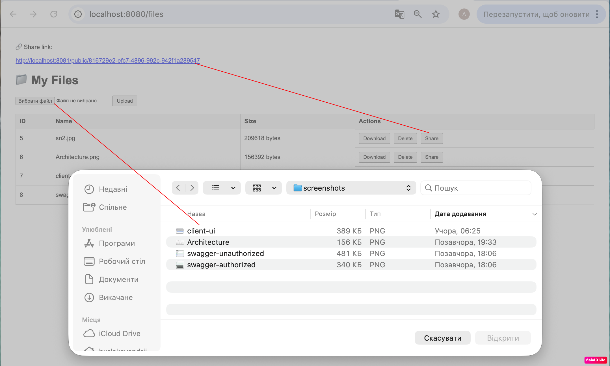
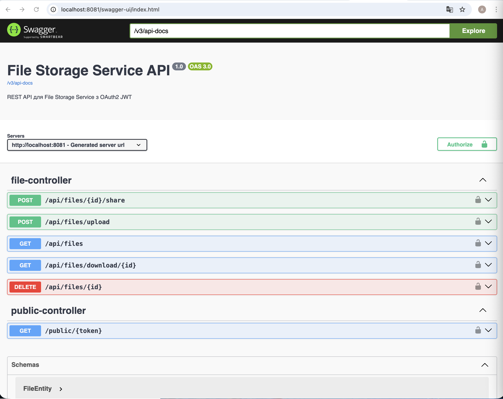
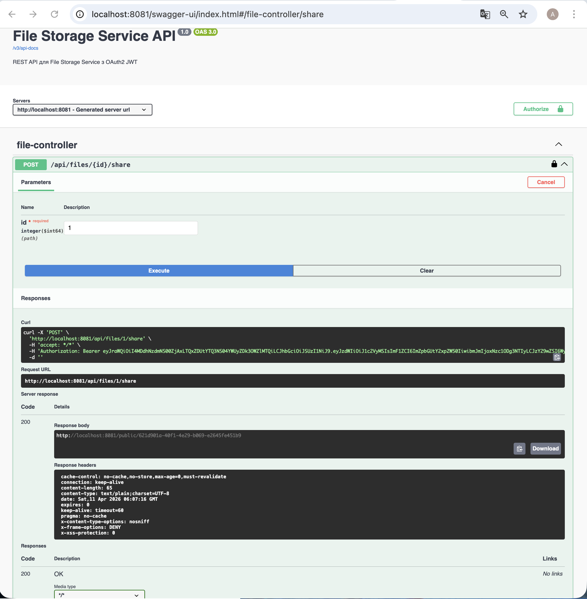
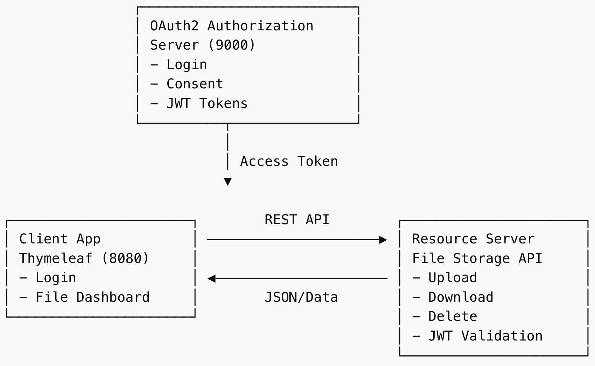

# File Storage Service (OAuth2)

Secure microservice-based file storage platform built with Java Spring Boot.

## 🚀 Tech Stack

Java 17 • Spring Boot 3 • OAuth2 • JWT • MySQL • Swagger • Thymeleaf

---

## 📌 Key Features

✔ OAuth2 Authorization Server  
✔ JWT-secured Resource Server  
✔ File Upload / Download / Delete  
✔ Swagger UI API Docs  
✔ Scope-based Access Control  
✔ Authorization Code + Refresh Token  

---

## 📸 UI Demo

### Get Access Token


### Main Dashboard


---

## 📸 Swagger API Documentation

### Swagger UI


### Authorized Testing


---

## 🏗 Architecture



---

## 📊 Architecture Diagram

Client App (8080)  
↓ OAuth2 Login  

Authorization Server (9000)  
↓ JWT Token  

Resource Server API (8081)  
↓  

MySQL Database

---

## ⚙️ Getting Started

1. Run Authorization Server → `localhost:9000`
2. Run Resource Server → `localhost:8081`
3. Run Client App → `localhost:8080`
4. Open Swagger UI → `localhost:8081/swagger-ui.html`

---

## 🔐 Demo Credentials

username: `user1`  
password: `password`

---

## 🌍 Environment Variables

```env
DB_PASSWORD=your_password
